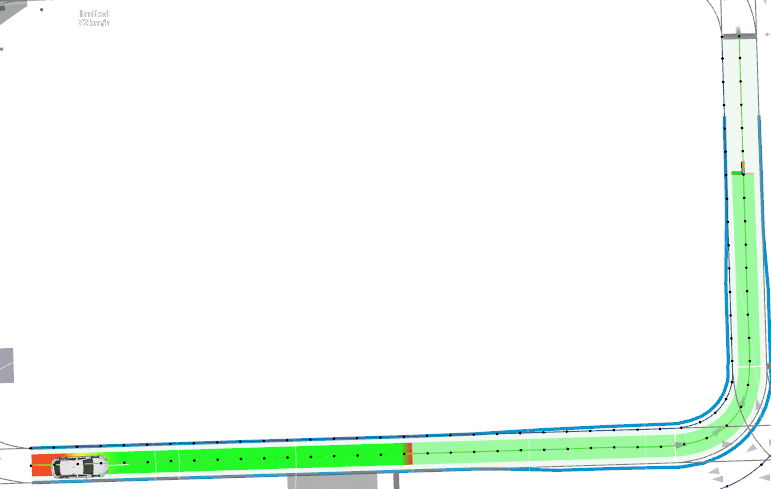

# Lanelets to Path
ROS2 node for converting an Autoware map and route in Lanelet2 format to a reference path represented by a vector of 2D points. 

## Installing
All components should be installed automatically using:

`rosdep install --from-paths src --ignore-src -r -y`

## Usage
Use:

```
ros2 launch lanelets_to_path lanelets_to_path.launch
```

Example output (green path and black dots):
